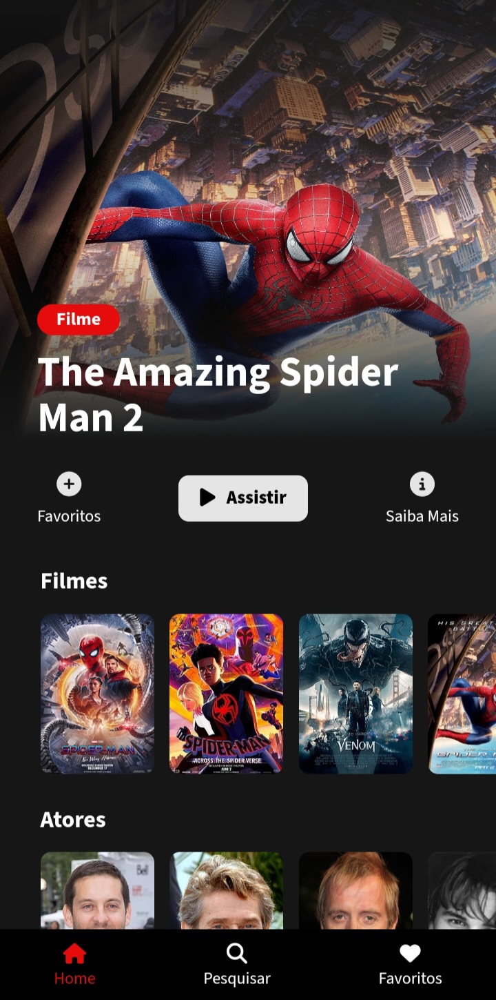

# Spider Wiki

# Introduction

This is my first FullStack development. I struggled o lot to do this, this was very important in my self journey. I learn new Things. I made the backend using NodeJS and MongoDB and the FrontEnd i made in Javascript.

# Preview



## How to run

1. Make the download to this project in:

```
https://github.com/mcsordi/spiderWiki_FrontEnd
```

2. After the download open the folder

```
spiderWiki_FrontEnd
```

3. After that you must to open the archive

```
index.html
```

### BackEnd application Link

```
https://github.com/mcsordi/spiderWiki_Actors_Api
```
